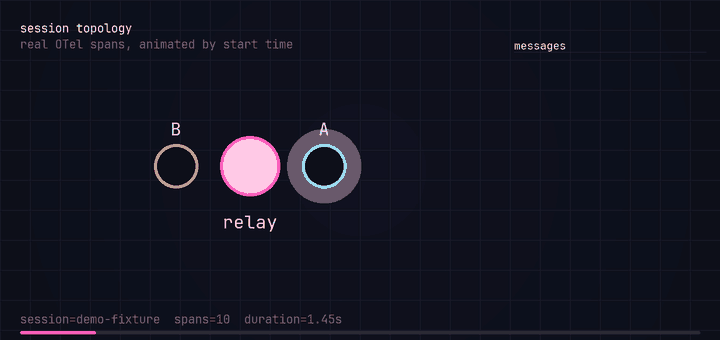
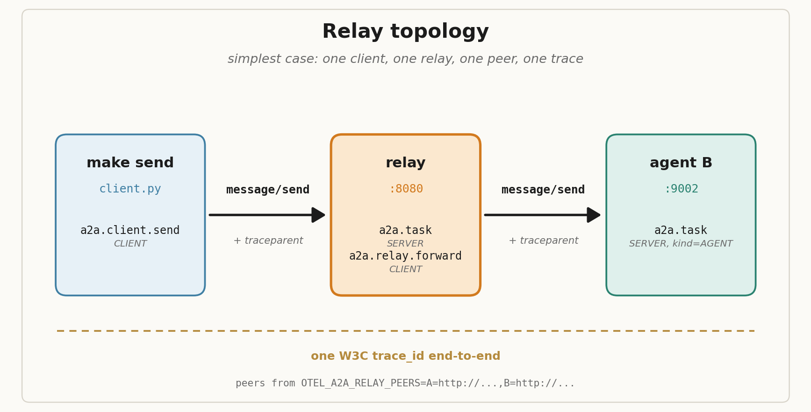

# 🔁🔗🤖 otel-a2a-relay (o2r)

Agent activity as [OTel](https://opentelemetry.io/) spans. The persistence layer is the legible thing: every agent message, handoff, and task transition becomes a queryable trace any OTel-native observability tool can render. [A2A](https://a2a-protocol.org/latest/specification/) is the current supported wire format. The session derivation generalizes to any transport-keyed channel - GitHub issue, Slack thread, Linear ticket - so the same trace shape holds when other wire formats land.

`otel-a2a-relay` is the canonical name (repo, package, protocol doc). `o2r` is the dictation-friendly shortname used in CLI entrypoints (`o2r`, `o2r-harness`), span identifiers (`service.name=o2r`, the relay's `agent.name`), and prose below.



A real session, animated. The relay is the magenta hub at the center; A and B are the leaves. Each particle is one A2A hop, drawn from a real Phoenix span; arcs above and below the chord let outbound and return hops cross visibly instead of overdrawing. Generate your own with `make demo && make gif CTX=demo`. Detailed below in [Animated session topology](#animated-session-topology).

## Pitch

Agent peers coordinate through this relay. Every message becomes one or more OTel spans, exported via [OTLP/HTTP](https://opentelemetry.io/docs/specs/otlp/) to whatever you've pointed `OTEL_EXPORTER_OTLP_ENDPOINT` at. The trace IS the operations view, no derived state needed. Subsumes the agent-channel protocol (see [coilysiren/coilyco-ai#24](https://github.com/coilysiren/coilyco-ai/issues/24)): the deterministic `sha256(<repo>:<issue>)` session ID makes any GitHub-issue-rooted coordination a first-class channel without server-side state.

- Currently supported wire format: A2A ([JSON-RPC 2.0](https://www.jsonrpc.org/specification) over HTTP, [AgentCards](https://a2a-protocol.org/latest/specification/#5-agent-discovery-the-agent-card), `message/send`, `tasks/get`, `tasks/cancel`).
- Persistence format: OTel spans, [OpenInference](https://github.com/Arize-ai/openinference) attributes for Phoenix's Agent Graph and Sessions views.
- Trace propagation: [W3C `traceparent`](https://www.w3.org/TR/trace-context/) end-to-end. Client → relay → peer is one trace.
- Channel derivation: deterministic `session.id` from any transport key (GitHub issue today, Slack thread / Linear ticket / file-on-disk by the same pattern).
- Default visualizer: [Phoenix](https://github.com/Arize-ai/phoenix). Anything OTLP-native works.

## Workspace layout

This repository is a [uv workspace](https://docs.astral.sh/uv/concepts/projects/workspaces/) with a backend-agnostic core and per-backend extensions. Each member is its own publishable Python package; cross-package deps are wired through the workspace.

- `otel-a2a-relay-core` - the relay HTTP server, `tracing.bootstrap()`, the echo A2A peer, the in-memory task store. No backend coupling. Point `OTEL_EXPORTER_OTLP_ENDPOINT` at any OTLP/HTTP collector.
- `otel-a2a-relay-arize-phoenix` - Phoenix-side validation harness, REST/GraphQL query helpers, animated topology GIF renderer, annotation+dataset bootstrapper, `make view` CLI.
- `otel-a2a-relay-tempo-grafana` - Tempo-side bootstrap helper, harness probe, dockerized Tempo+Grafana stack with provisioned datasource and a LUCA-flow Grafana dashboard.
- `luca-flow` - the AURORA microsite multi-agent demo, backend-agnostic.

## Quickstart

Pick a backend (or run both side by side - they coexist on different ports). All paths work identically through `core`'s `tracing.bootstrap()`.

### Phoenix backend

```sh
uv sync --all-packages
make phoenix-fg                   # in another terminal (operator-owned)
make phoenix-bootstrap            # one-time annotation configs + datasets
OTEL_EXPORTER_OTLP_ENDPOINT=http://localhost:6006 make luca-demo
open http://localhost:6006        # Phoenix Sessions tab
```

### Tempo + Grafana backend

```sh
uv sync --all-packages
make tempo-up                     # docker compose Tempo + Grafana
OTEL_EXPORTER_OTLP_ENDPOINT=http://localhost:4318 make luca-demo
open http://localhost:3000/d/luca-flow/luca-flow
```

### Other backends

`tracing.bootstrap()` ships standard OTLP/HTTP - point it at Honeycomb, Datadog, or any OTel-native backend by setting `OTEL_EXPORTER_OTLP_ENDPOINT`. The protocol attributes (`session.id`, `agent.role`, `o2r.*`) work everywhere; backend-specific UX (annotation configs in Phoenix, dashboards in Grafana) is added by extension packages.

## Commands

Agents route through coily; see [.coily/coily.yaml](.coily/coily.yaml). Humans: `make help` for the full target list.

## Topology



This is the simplest shape the relay supports: one client, one relay, one peer, one trace. Real flows are more interesting. The [LUCA-flow demo](#luca-flow-demo) below runs eight workers, an orchestrator, a planner, a validator, and a deployer through this same relay, with star-topology enforcement, retries, a deliberate worker crash, and a rogue worker that gets gated by the relay.

The relay's peer registry comes from `OTEL_A2A_RELAY_PEERS=A=http://...,B=http://...`. The Makefile sets this for you. If a target in `metadata.agent.target` has no peer registered, the relay synthesizes a completed Task and skips the forward.

Diagram source: [`scripts/render_topology.py`](scripts/render_topology.py). Regenerate with `uv run --with matplotlib python scripts/render_topology.py`.

## Animated session topology

`assets/topology.png` (above) is the protocol-shape illustration, a fixed cartoon. `assets/session-topology.gif` (the hero at the top) is the temporal one: real OTel spans for one session, animated by start time, against the same star.

```sh
make phoenix-fg                # operator-owned, in another terminal
make demo                      # produces a `demo` session
OUT=mine.gif make gif CTX=demo # writes mine.gif from real Phoenix spans
```

The renderer pulls every span tagged with `session.id == $CTX` from Phoenix's GraphQL endpoint, reduces them into hops (parent -> agent), auto-detects the relay as the hub, sorts the leaves alphabetically for a stable color palette, and animates each hop in start-time order. Two hops in the same tick render with their arcs bowed in opposite directions, so a forward-and-return pair reads as crossings rather than as a single overdrawn line.

Determinism is baked in: same `session.id` against the same Phoenix DB produces a byte-identical GIF. Tests assert this against a synthetic-span fixture in `arize_phoenix/tests/fixtures/sessions.py`, so a renderer regression fails CI before the README hero drifts. The renderer is Pillow-only (no matplotlib); freetype ships with Pillow, JetBrains Mono ships in `arize_phoenix/src/otel_a2a_relay_arize_phoenix/viz/assets/`, the GIF palette is built once and reused across frames. To intentionally regenerate the README hero after a renderer change, run `python -m tests.fixtures.regen_session_gifs` from `arize_phoenix/` and commit the new bytes.

The viz extra is opt-in:

```sh
uv sync --extra viz
```

`make gif` does this automatically. The base relay install stays Pillow-free.

## Methods

- `message/send` - send a message, get a Task back. The originator sets `metadata.agent.id` (sender) and optionally `metadata.agent.target` (recipient).
- `message/stream` - same envelope as `message/send`, but the response is `text/event-stream` carrying A2A `status-update` and `artifact-update` events. The relay forwards the SSE through and emits one `a2a.message.stream_chunk` span event per artifact.
- `tasks/get` - retrieve a Task by id from the relay's in-memory store. Each peer agent indexes its own tasks too.
- `tasks/cancel` - mark a Task as canceled and emit an `a2a.task.cancel` span.

The peer agent serves an A2A AgentCard at `/.well-known/agent.json` (capabilities, skills, protocol version). The relay's `GET /peers` aggregates them for discovery.

## Span shape

Every `a2a.task` carries `session.id`, `a2a.task.id`, `agent.id`, `graph.node.id`, `graph.node.parent_id`, `openinference.span.kind=AGENT`, plus `input.value` / `output.value` (OpenInference) and `a2a.message.text` / `a2a.message.reply_text` shortcuts. State changes are span events (`a2a.task.state_change` with `from` / `to`). Stream chunks are span events (`a2a.message.stream_chunk` with `seq` / `final`).

The original v0.1 protocol document at [`docs/protocol.md`](docs/protocol.md) is the precedent and explains why agent identity rides on attributes (Phoenix drops Resource attributes), why the Agent Graph uses `graph.node.*` (Phoenix doesn't expose span links), and why state changes are events not spans (tree noise vs queryable timeline).

## LUCA-flow demo

[`examples/luca-flow/`](examples/luca-flow/) is a real multi-agent choreography that dogfoods the relay end-to-end. Eight worker subprocesses + an orchestrator + a planner + a validator + a deployer build the AURORA microsite (a fictional consumer desk lamp marketed as if it physically channels solar-wind charged particles) from real public-domain NASA imagery committed to the repo. Star topology is enforced by the relay; one worker deliberately crashes, another deliberately tries to bypass the orchestrator and gets a `-32010` from the relay's gate.

The demo only depends on `otel-a2a-relay-core`. Pick whichever backend you want to send the spans to:

```sh
# Phoenix
make phoenix-fg
OTEL_EXPORTER_OTLP_ENDPOINT=http://localhost:6006 make luca-demo

# Tempo + Grafana
make tempo-up
OTEL_EXPORTER_OTLP_ENDPOINT=http://localhost:4318 make luca-demo
```

The same flow runs in CI on every push (`.github/workflows/luca-demo.yml`), with Phoenix in CI as a background process. The built `dist/` is uploaded as a workflow artifact. See [`examples/luca-flow/README.md`](examples/luca-flow/README.md) for the choreography and validation rules.

## Related

Operator CLI: [`coily channel`](https://github.com/coilysiren/coily) once that side catches up. Origin discussion: [coilysiren/coilyco-ai#24](https://github.com/coilysiren/coilyco-ai/issues/24).

## See also

- [AGENTS.md](AGENTS.md) - agent-facing operating rules.
- [docs/FEATURES.md](docs/FEATURES.md) - inventory of what ships today.
- [.coily/coily.yaml](.coily/coily.yaml) - allowlisted commands. Agents route through coily, not bare `make` / `uv` / `python`.

Cross-reference convention from [coilysiren/coilyco-ai#313](https://github.com/coilysiren/coilyco-ai/issues/313). This repo is the worked example.

## License

MIT.
